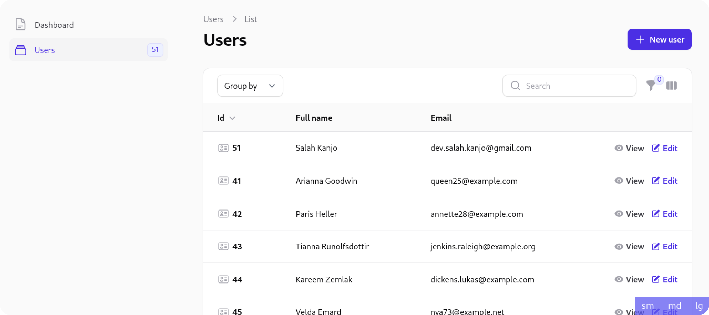

<h1 align="center">↻ Filament layout inspector</h1>

<p align="center">
    <a href="https://github.com/sakanjo/filament-layout-inspector/actions"></a>
    <a href="https://laravel.com"></a>
    <a href="https://php.net"></a>
</p>

<p align="center">Visually examine the layout of your Filament app.</p>

> ✨ Help support the maintenance of this package by [sponsoring me](https://github.com/sponsors/sakanjo).



Table of Contents
=================

* [Install](#-install)
* [Usage](#-usage)
* [Support the development](#-support-the-development)
* [Credits](#%EF%B8%8F-credits)
* [License](#-license)

## 📦 Install

1. Install the package via composer:

```
composer require --dev sakanjo/filament-layout-inspector
```

2. Add the plugin's views to your tailwind.config.js file.

```js
content: [
    './vendor/sakanjo/filament-layout-inspector/resources/**/*.blade.php',
]
```

## 🦄 Usage

```php
<?php

// ...
use SaKanjo\FilamentLayoutInspector\LayoutInspectorPlugin;

public function panel(Panel $panel): Panel
{
    return $panel
        ->plugin(
            LayoutInspectorPlugin::make()
                ->visible(fn () => app()->isLocal())
                ->screens([
                    '4xl' // max-4xl:hidden
                    '5xl' // max-5xl:hidden
                ])
        );
}
```

## 💖 Support the development

**Do you like this project? Support it by donating**

Click the ["💖 Sponsor"](https://github.com/sponsors/sakanjo) at the top of this repo.

## ©️ Credits

- [Salah Kanjo](https://github.com/sakanjo)
- [All Contributors](../../contributors)

## 📄 License

[MIT License](https://github.com/sakanjo/filament-layout-inspector/blob/master/LICENSE) © 2023-PRESENT [Salah Kanjo](https://github.com/sakanjo)
